# 1장 스프링, 클라우드와 만나다

- 마이크로서비스는 분산되고 느슨하게 결합된 소프트웨어 서비스로, 명확히 정의된 몇 가지 작업을 수행한다.

## 1.1 마이크로서비스란?

- 마이크로서비스 개념이 발전하기 전, 대부분의 웹 기반 애플리케이션은 모놀리식(monolithic architecture) 형태로 개발되었고, 애플리케이션은 배포 가능한 단일 소프트웨어 산출물로 전달된다.
- 모놀리식 애플리케이션이 크고 복잡해지면 애플리케이션을 담당하는 각 팀의 의사소통과 조정 비용이 증가하고, 각 팀에서 변경이 있을 때마다 애플리케이션 전체를 다시 빌드하고 테스트해서 배포해야 한다.

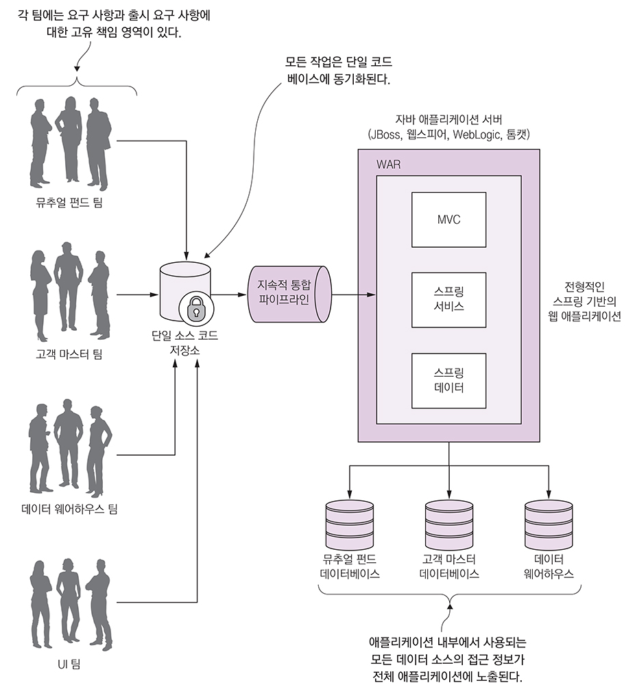

- 마이크로서비스 개념은 2014년경 소프트웨어 개발 커뮤니티에서 인식되기 시작했다.
- 마이크로서비스를 사용하면 대형 애플리케이션을 관리하기 쉽고, 제한된 책임을 담당하는 컴포넌트로 분해할 수 있다.

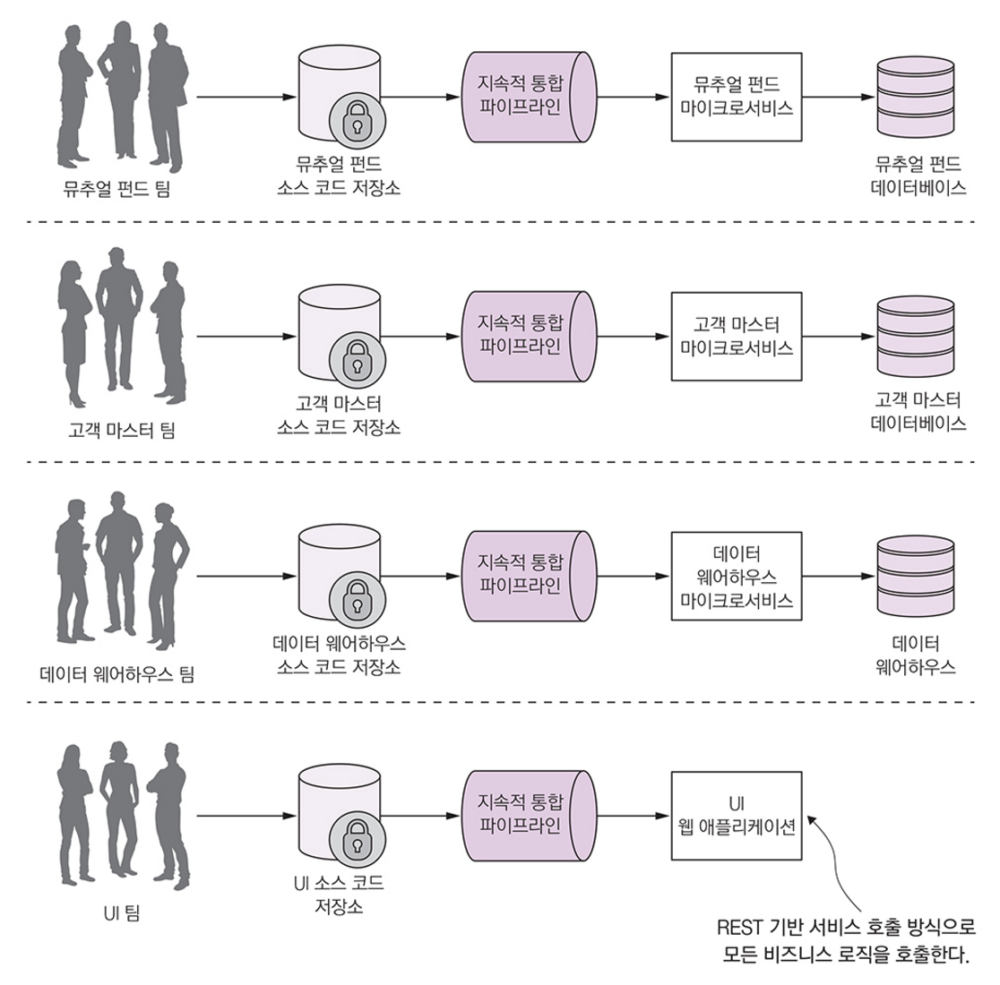

- 마이크로 서비스 아키텍처의 특징
    - 애플리케이션 로직을 각자 책임이 명확한 작은 컴포넌트들로 분해하고 이들을 조합해서 솔루션을 제공한다.
    - 각 컴포넌트는 작은 책임 영역을 담당하고 완전히 상호 독립적으로 배포된다. 여러 애플리케이션에서 재사용할 수 있어야 한다.
    - 마이크로서비스는 몇 가지 기본 원칙에 기반을 두며, HTTP 와 JSON 같은 경량 통신 프로토콜을 사용한다.
    - 애플리케이션은 항상 기술 중립적 프로토콜을 사용해 통신하므로 서비스 구현 기술과는 무관하다.
    - 작고 독립적이며 분산된 마이크로서비스를 사용해 조직은 명확히 정의된 책임 영역을 담당하는 소규모 팀을 보유할 수 있다. 이들은 자기가 개발하는 서비스만 책임진다.

## 1.2 스프링은 무엇이고 마이크로서비스와 어떤 관련이 있을까?

- 스프링은 의존성 주입(dependency injection) 이라는 핵심 개념에 기반을 둔다.
- 일반적인 자바 어플리케이션은 각 클래스가 애플리케이션의 다른 클래스와 명시적으로 링크된 클래스로 분해된다.
- 링크는 코드에서 킬래스 생성자를 직접 호출하는 것이고, 일단 코드가 컴파일되면 이러한 링크 지점은 변경될 수 없다.
- 외부 링크는 깨지기 쉽고, 변경되면 다른 코드에 후속적인 영향을 줄 수 있어 대규모 프로젝트에서 문제가 된다.
- 스프링처럼 의존성 주입 프레임워크를 사용하면 애플리케이션 안에서 관련 있는 객체가 서로 상대에 관한 정보를 하드코딩 하지 않고, 관례와 애너테이션으로 객체간 관계를 외부화할 수 있다.
- 스프링 부트는 스프링 프레임워크를 재구성해 REST 지향 마이크로서비스 프레임워크를 제공한다.
- 스프링 클라우드 프레임워크를 사용하면 사설(private) 및 공용(public) 클라우드에 마이크로서비스를 쉽게 운영하고 배포할 수 있다.

## 1.3 책에서 다루는 내용

- 마이크로서비스 정의와 마이크로서비스 기반 애플리케이션을 구축할 때 설계 고려 사항
- 마이크로서비스 기반 애플리케이션을 사용하면 안 될 때
- 스프링 부트 프레임워크로 마이크로서비스를 구축하는 방법
- 마이크로서비스 애플리케이션, 특히 클라우드 기반 애플리케이션을 위해 필수적인 핵심 작동 패턴
- 스프링 클라우드를 사용한 작동 패턴의 구현 방법
- 배운 것을 활용해 서비스를 내부에서 관리하는 사설 클라우드나 공용 클라우드 공급자에게 배포할 수 있는 배포 파이프라인의 구축 방법

## 1.4 대상 독자

- 자바 개발자
- 스프링 배경지식이 있는 사람
- 마이크로서비스 기반 애플리케이션을 구축하는 방법에 관심이 있는 사람
- 마이크로서비스를 사용해 클라우드 기반 애플리케이션을 구축하는 방법에 관심이 있는 사람
- 자바와 스프링이 마이크로서비스 기반 애플리케이션을 구축하는 데 적절한 기술인지 알고 싶은 사람
- 마이크로서비스 기반 애플리케이션을 클라우드에 배포하는 데 필요한 것을 알고 싶은 사람

## 1.5 스프링 부트로 마이크로서비스 구축

- 필자는 '카넬 멍키 테스트(Carnell [Monkey Test](https://en.wikipedia.org/wiki/Monkey_testing))' 라는 이름의 테스트를 통과한다면 사용하기 쉬울것이라 생각했고, 스프링 부트 예제를 처음 작성했을때 그렇게 느꼈다고 한다.
- 그림 1-3 에서 서비스가 하는 일과 스프링 부트 마이크로서비스가 사용자 요청을 처리하는 일반적 흐름을 볼 수 있다.

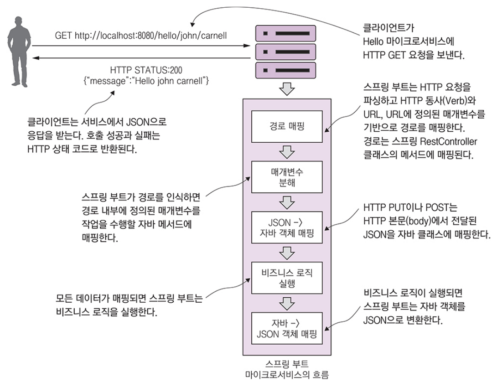

```java
package com.vroong.ssmia.demo;

import org.springframework.boot.SpringApplication;
import org.springframework.boot.autoconfigure.SpringBootApplication;
import org.springframework.web.bind.annotation.PathVariable;
import org.springframework.web.bind.annotation.RequestMapping;
import org.springframework.web.bind.annotation.RequestMethod;
import org.springframework.web.bind.annotation.RestController;

@SpringBootApplication // 스프링 부트 프레임워크에 이 클래스가 스프링 부트 서비스의 진입점이라고 지정한다.
@RestController // 스프링 부트에 이 클래스의 코드를 스프링 RestController 클래스로 노출하도록 지정한다.
@RequestMapping(value = "hello") // 이 애플리케이션에서 노출된 URL 은 /hello 가 앞에 붙는다.
public class Application {

  public static void main(String[] args) {
    SpringApplication.run(Application.class, args);
  }

  @RequestMapping(value = "/{firstName}/{lastName}", method = RequestMethod.GET) // 스프링 부트는 두 매개변수인 firstName 과 lastName 을 입력받는 GET 기반의 REST 엔드포인트로 노출한다.
  public String hello(
      @PathVariable("firstName") String firstName, // URL 에 전달된 firstName 과 lastName 매개변수를 hello 함수에 전달하는 두 변수에 매핑한다.
      @PathVariable("lastName") String lastName) {

    return String.format("{\"message\":\"Hello %s %s\"}", firstName, lastName); // 간단한 JSON 문자열을 만들어 반환한다.
  }
}
```

ref. [Gradle Multi Project](https://docs.gradle.org/current/userguide/intro_multi_project_builds.html)

```shell script
$ ./gradlew clean :demo:bootRun
```

```commandline
gradlew clean :demo:bootRun
```

- 내장된 톰캣(Tomcat) 서버를 사용하는 애플리케이션을 시작한다.

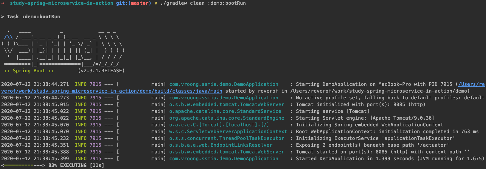

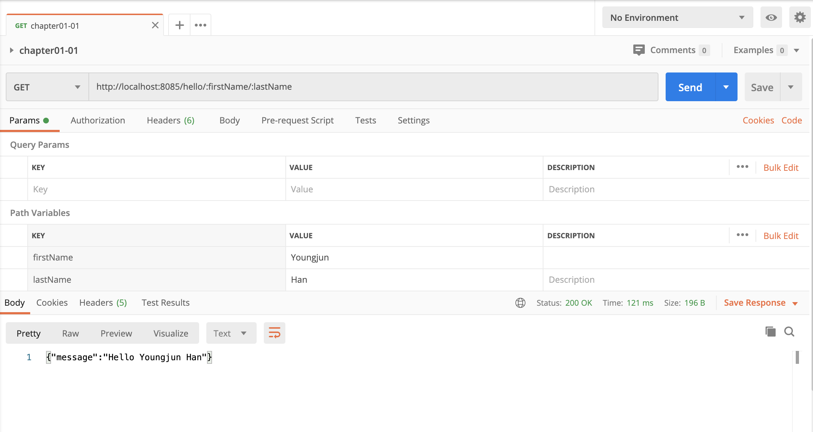

## 1.6 애플리케이션 구축 방식을 바꾸는 이유

- 현대 사회는 거의 모든 것을 인터넷을 통해 연결하기 때문에 글로벌 고객 기반을 확보할 수 있다.
- 애플리케이션 구축을 바라보는 방식이 영향을 받는 현상들
    - 복잡성의 증가: 오늘날 애플리케이션은 회사 데이터센터 내부의 여러 서비스와 데이터베이스뿐만 아니라 인터넷으로 외부 서비스 제공자와도 통신해야 한다.
    - 더 빠른 출시: 고객은 더 이상 소프트웨어 패키지를 연 단위로 릴리스 하거나 버전을 올리길 기대하지 않는다.
    - 성능 및 확장성: 글로벌 애플리케이션에서는 애플리케이션이 처리해야 할 트랜잭션 양과 유입될 시점을 매우 예측하기 어렵기 때문에 여러 서버로 신속히 확장한 후 확장이 필요 없다면 다시 축소해야 한다.
    - 항상 사용할 수 있기를 기대한다: 애플리케이션의 한 부분에서 에러나 문제가 있어도 애플리케이션 전체가 다운되어서는 안 된다.
- 기대 사항을 충족하려면 확장성과 중복성이 높은 애플리케이션을 구축하기 위해 독립적으로 빌드하고 배포할 수 있는 작은 서비스로 애플리케이션을 분해해야 한다.
- 애플리케이션을 작은 서비스로 떼어낼 때의 장점
    - 유연성(flexible): 코드 단위가 작을수록 코드 변경에 따른 복잡성을 낮추고 코드 배포를 테스트하는 시간도 줄어든다.
    - 회복성(resilient): 실패는 애플리케이션의 작은 부분에 국한되어 애플리케이션 전체 장애로 확대되기 전에 억제된다.
    - 확장성(scalable): 분리된 서비스를 여러 서버에 수평적으로 쉽게 분산할 수 있어 기능 및 서비스를 적절히 확장할 수 있다.
- 작고(small) 단순하며(simple) 분리된(decoupled) 서비스 = 확장 가능하고(scalable) 회복적이며(resilient) 유연한(flexible) 애플리케이션

## 1.7 클라우드란 정확히 무엇인가?

- 클라우드 기반 컴퓨팅
    - IaaS(Infrastructure as a Service)
    - PaaS(Platform as a Service)
    - SaaS(Software as a Service)

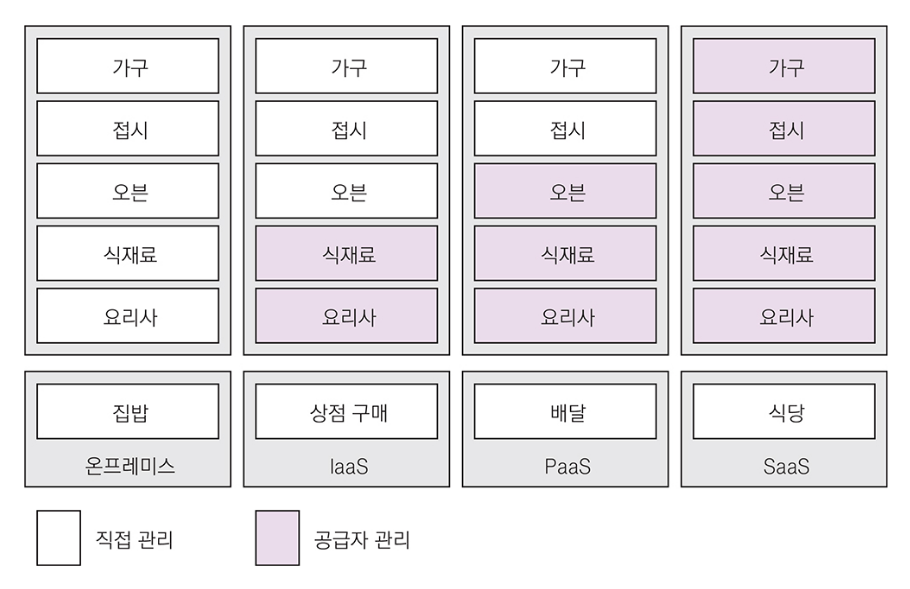

- 각 모델에서 요점은 통제에 관한 것, 즉 누가 인프라스트럭처를 유지 보수하고 애플리케이션 구축을 위해 어떤 기술을 사용할지 하는 점
- 새로운 클라우드 플랫폼
    - FaaS(Function as a Service): Amazon Lambda, Google Cloud Functions
    - CaaS(Container as a Service): Amazon ECS(Elastic Container Service)

## 1.8 왜 클라우드와 마이크로서비스인가?

- 마이크로서비스 기반 아키텍처의 핵심: 각 서비스를 독립된 개별 산출물로 패키징하고 배포한다
- 마이크로서비스의 배포
    - 물리적 서버: 빠르게 용량을 늘릴 수 없다
    - 가상 머신 이미지: 서비스의 여러 인스턴스를 신속하게 IaaS형 사설 및 공용 클라우드에 배포할 수 있다
    - 가상 컨테이너: 하나의 가상 머신을 같은 가상 머신 이미지를 공유하는 완전 자립형 프로세스로 분리할 수 있다
- 클라우드에 기반을 둔 마이크로서비스의 장점은 탄력성
    - 간소화된 인프라스트럭처 관리: IaaS 클라우드 공급자는 서비스를 최대한 통제할 수 있는 역량을 제공
    - 엄청난 수평 확장성: Iaas 클라우드 공급자를 사용하면 하나 이상의 서비스 인스턴스를 신속하고 간결하게 시작할 수 있다
    - 지리적 분산을 이용한 높은 중복성: IaaS 클라우드에 마이크로서비스를 배포하면 데이터센터의 클러스터보다 더 높은 수준의 중복성을 얻을 수 있다
- FaaS 를 사용하지 않는 이유
    - FaaS 기반 플랫폼을 사용할 때 주의하지 않는다면 코드를 공급자별 런타임 엔진에 배포하기 때문에 코드가 클라우드 공급자의 플랫폼에 락인(lock-in) 될 수 있다
    - FaaS 기반 모델에서 일반적인 프로그래밍 언어로 서비스를 작성할 수 있지만 여전히 하부 공급자의 API 와 기능이 배포될 런타임 엔진과 상당히 엮인다

## 1.9 마이크로서비스는 코드 작성 이상을 의미

- 견고한 서비스를 작성하는 몇 가지 주제

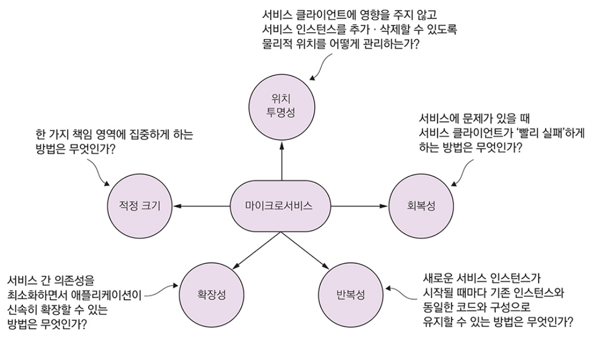

- 적정 크기: 서비스가 적절한 크기가 되면 애플리케이션을 신속히 변경하고 전체 애플리케이션의 전반적인 장애를 줄일 수 있다
- 위치 투명성: 서비스의 다수 인스턴스가 시작하고 종료될 때 서비스 호출에 대한 물리적 상세 정보를 관리할 수 있는 방법
- 회복성: 장애가 발생한 서비스를 우회하고 '빨리 실패'하는 방법을 사용해 마이크로서비스 소비자를 보호하고 애플리케이션의 전반적 무결성을 유지
- 반복성: 새로운 인스턴스가 시작할 때마다 운영 환경의 다른 서비스 인스턴스 구성과 코드 베이스를 동일하게 만드는 방법
- 확장성: 비동기 프로세싱과 이벤트를 사용해 서비스 간 의존성을 최소하하고 원만하게 확장할 수 있는 방법
- 위에 나열된 내용들을 지원하기 위한 패턴 기반 접근방법
    - 핵심 개발 패턴(core development patterns)
    - 라우팅 패턴(routing patterns)
    - 클라이언트 회복성 패턴(client resiliency patterns)
    - 보안 패턴(security patterns)
    - 로깅 및 추적 패턴(logging and tracing patterns)
    - 빌드 및 배포 패턴(build and deployment patterns)

### 1.9.1 마이크로서비스 핵심 개발 패턴

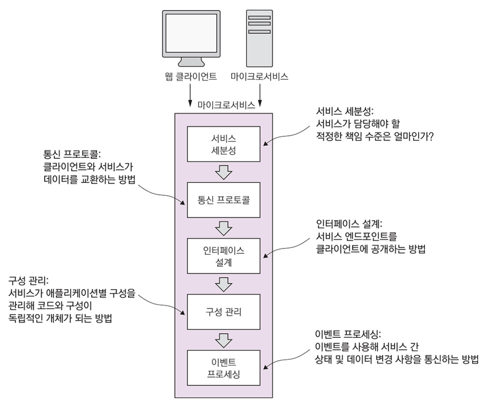

- 서비스 세분성: 비즈니스 영역을 마이크로서비스로 분해할 때 적정 수준의 책임을 갖게 하는 방법
    - 다른 비즈니스 문제 영역과 책임이 겹치도록 나뉘면 시간이 지나면서 유지 보수와 변경이 어려워진다
    - 너무 잘게 나뉘면 애플리케이션의 복잡성이 증가되고, 데이터 저장소에 액세스하는 것 외에 아무런 로직도 없는 '멍청한' 데이터 추상화 계층으로 전락한다
    - 2.1.2 서비스 세분성의 확정 에서 다룬다
- 통신 프로토콜: JSON 이 가장 이상적인 이유와 마이크로서비스와 데이터를 교환하는 데 일반적으로 선택되는 이유를 2장에서 다룬다
- 인터페이스 설계: 잘 설계된 마이크로서비스 인터페이스가 있다면 서비스를 직관적으로 사용할 수 있다 (서비스 설계는 2장에서 다룬다)
- 서비스 간 이벤트 프로세싱: 서비스 간 하드 코딩된 의존성을 최소화하고 애플리케이션 회복성을 높이기 위해 마이크로서비스를 분리하는 방법 (8장 서비스 간 이벤트 프로세싱에서 다룬다)

### 1.9.2 마이크로서비스 라우팅 패턴

- 마이크로서비스를 사용하려는 클라이언트 애플리케이션 서비스의 위치를 발견하고 라우팅하는 방법
- 수백개의 인스턴스가 실행중일 수 있는 서비스의 물리적 IP 주소를 추상화하고 서비스 호출에 대한 단일 진입점을 만들어야 모든 서비스 호출에 대한 일관된 보안과 콘텐츠 정책을 보장
- 서비스 디스커버리와 라우팅
    - 서비스 디스커버리(service discovery): 클라이언트가 서비스 위치를 하드 코딩하지 않고 찾을 수 있도록 탐색 가능하게 만드는 방법 (4장에서 다룬다)
    - 서비스 라우팅(service routing): 보안 정책과 라우팅 규칙을 적용하기 위해 모든 서비스에 대한 단일 진입점을 제공 하는 방법 (6장에서 다룬다)

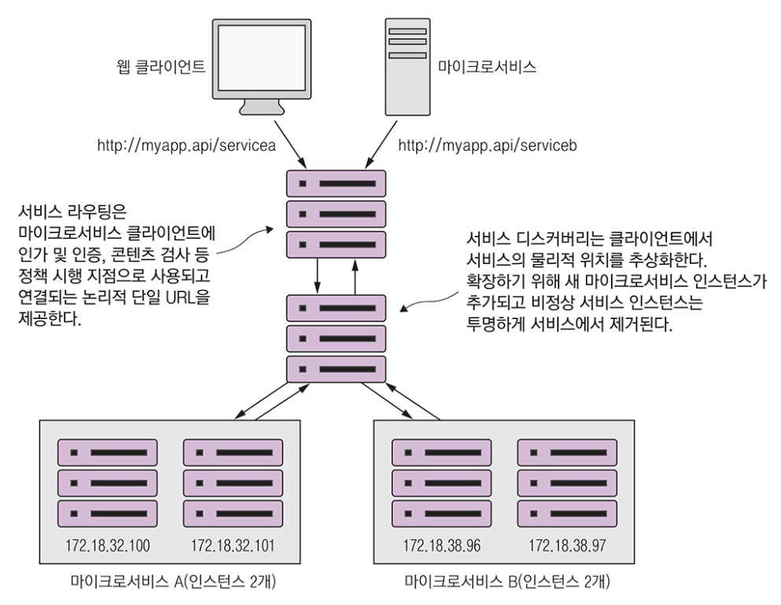

### 1.9.3 마이크로서비스 클라이언트 회복성 패턴

- 마이크로서비스 아키텍처는 고도로 분산되어 있어서 1개의 서비스 문제가 서비스 소비자에게 연쇄적으로 발생하지 않도록 방지하는 데 매우 민감해져야 한다
- 클라이언트 회복성 패턴(5장에서 다룸)
    - 클라이언트 측 부하 분산(client-side load balancing): 여러 인스턴스에 대한 호출이 분산되도록 서비스 인스턴스의 위치를 캐싱
    - 회로 차단기 패턴(circuit breakers pattern): 고장나거나 성능 문제가 있는 서비스를 계속 호출하지 않게 하는 방법
    - 폴백 패턴(fallback pattern): 서비스 호출이 실패할 때 호출한 마이크로서비스가 아닌 다른 대체 수단을 사용해 클라이언트가 작업을 수행할 수 있게 하는 '플러그인' 매커니즘
    - 벌크헤드 패턴(bulkhead pattern): 오작동하는 서비스 호출 하나가 나머지 애플리케이션에 부정적인 영향을 미치지 않도록 구분하는 방법

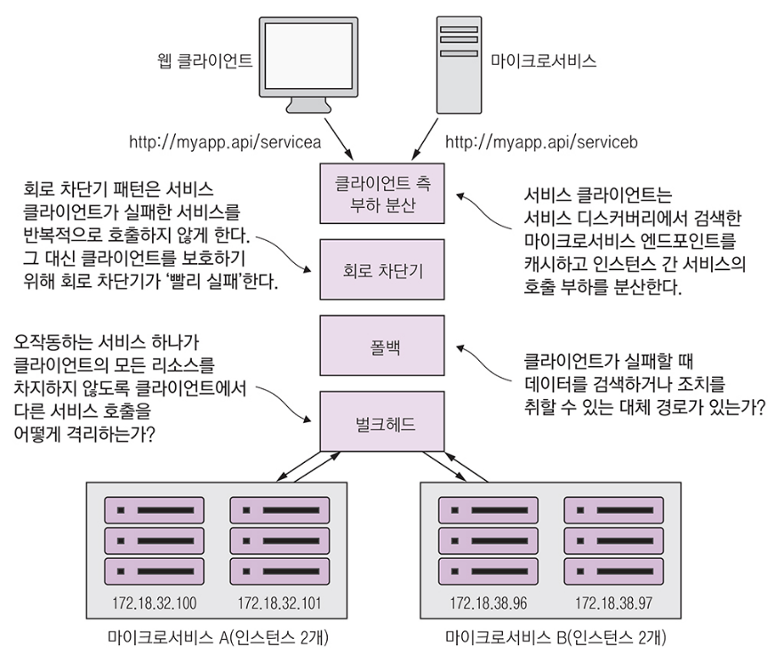

### 1.9.4 마이크로서비스 보안 패턴

- 세가지 기본 보안 패턴(7장에서 다룸)
    - 인증(authentication): 서비스를 호출하는 클라이언트를 확인
    - 인가(authorization): 서비스를 호출하는 클라이언트가 수행하려는 작업을 수행할 자격이 있는지 확인
    - 자격 증명 관리(credential management)와 전파(propagation): 서비스 클라이언트가 한 트랜잭션과 관련된 여러 서비스 호출에서 자격 증명을 항상 제시하지 않아도 되는 방법

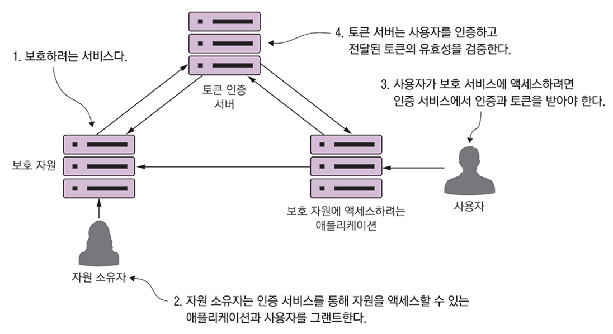

### 1.9.5 마이크로서비스 로깅 및 추적 패턴

- 마이크로 서비스의 장점: 모놀로식 애플리케이션이 작은 기능 단위로 분해되어 독립적으로 배포된다
- 마이크로 서비스의 단점: 애플리케이션과 서비스 안에서 어떤 일이 일어나고 있는지 디버깅과 추적이 훨씬 더 어렵다
- 세가지 로깅 및 추적 패턴(9장에서 다룸)
    - 로그 상관관계(log correlation): 단일 트랜잭션에 대해 여러 서비스 간 생성된 모든 로그를 함께 연결하는 방법
    - 로그 수집(log aggregation): 서비스에서 생성된 모든 로그를 질의 가능한 단일 데이터베이스로 취합하는 방법
    - 마이크로서비스 추적(microservice tracing): 트랜잭션과 연관된 모든 서비스에서 클라이언트 트랜잭션 흐름을 시작화하고 트랜잭션과 관련된 서비스의 성능 특성을 이해하는 방법

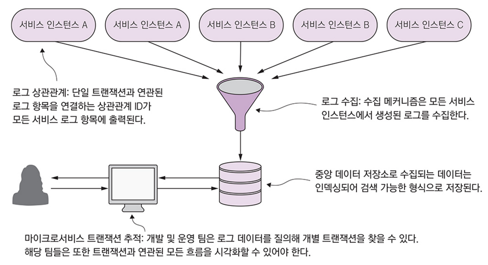

### 1.9.6 마이크로서비스 빌드 및 배포 패턴

- 마이크로서비스는 서비가 배포된 이후 변경 때문에 발생하는 '구성편차(configuration drift)'는 애플리케이션 안정성을 해치므로 허용될 수 없다
- 불변 인프라스트럭처(immutable infrastructure): 서비스가 배포되고 나면 서비스가 실행 중인 인프라스트럭처를 절대로 사람이 직접 건드려서는 안 된다
- 단일 작업 단위로 배포하는 방법(10장에서 다룸)
    - 빌드 및 배포 파이프라인: 원클릭 빌드와 배포를 강조하는 반복 가능한 빌드 및 배포 프로세스
    - 코드형 인프라스트럭처(infrastructure as code): 코드로 서비스 프로비저닝을 처리
    - 불변 서버(immutable servers): 이미지를 생성하고 배포한 후 변경하지 못하게 함
    - 피닉스 서버(phoenix servers): 서버를 정기적으로 해제(종료)하고 불변 이미지를 재생성 함

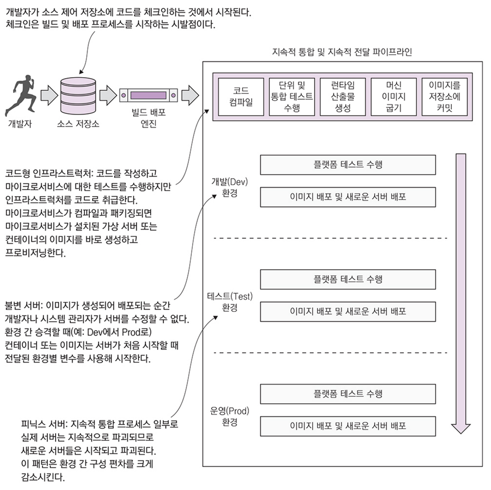

## 1.10 스프링 클라우드로 마이크로서비스 구축

- 스프링 팀은 대중적인 많은 오픈소스 프로젝트를 스프링 클라우드(http://projects.spring.io/spring-cloud/)로 알려진 스프링 하위 프로젝트로 통합했다

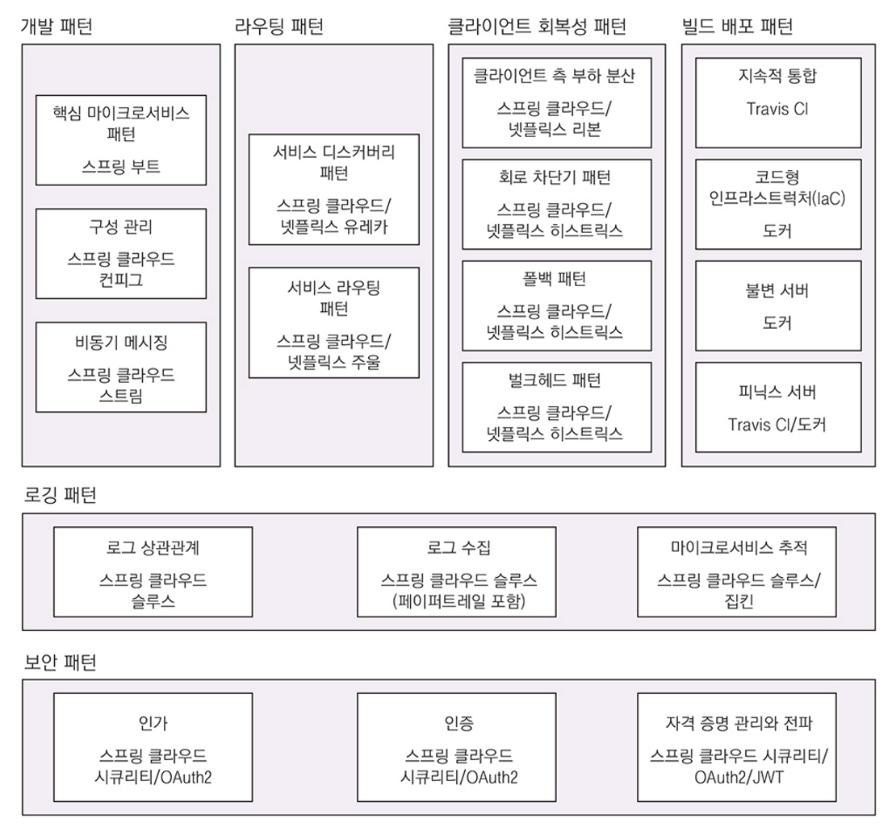

### 1.10.1 스프링 부트

- REST 기반 마이크로서비스를 구축하는 주요 작업을 단순화해 마이크로서비스를 쉽게 개발할 수 있다.

### 1.10.2 스프링 클라우드 컨피그

- 중앙 집중식 서비스로 애플리케이션 구성 데이터 관리를 담당하고 애플리케이션 데이터를 마이크로서비스와 분리한다.
- 스프링 클라우드 컨피그에는 고유한 관리 저장소가 있지만 다음 오픈소스 프로젝트와도 통합된다.
    - 깃(Git)
    - 콘설(Consul): 오픈 소스 서비스 디스커버리 도구, 스프링 클라우드 컨피그와 함께 사용될 수 있는 키-값 저장소 기반 데이터베이스도 있다
    - 유레카(Eureka): 오픈 소스 서비스 디스커버리 도구, 스프링 클라우드 컨피그와 함께 사용될 수 있는 키-값 저장소 기반 데이터베이스도 있다

### 1.10.3 스프링 클라우드 서비스 디스커버리

- 스프링 클라우드 서비스 디스커버리를 사용하면 서버가 배포된 물리적 위치를 추상화할 수 있다.
- 서비스 디스커버리 엔진의 구현을 위해 콘설과 유레카를 사용할 수 있다.

### 1.10.4 스프링 클라우드/넷플릭스 히스트릭스와 리본

- 회복성 패턴을 위해 스프링 클라우드는 넷플릭스 [히스트릭스](https://github.com/Netflix/Hystrix) 라이브러리와 [리본](https://github.com/Netflix/ribbon) 프로젝트를 사용한다.
- 넷플릭스 히스트릭스 라이브러리를 사용하면 회로 차단기와 벌크헤드 같은 서비스 클라이언트의 회복성 패턴을 신속하게 구현할 수 있다.
- 넷플릭스 리본 프로젝트는 서비스 소비자가 서비스 호출에 대한 클라이언트 측 부하 분산 기능도 제공한다.

### 1.10.5 스프링 클라우드/넷플릭스 주울

- 스프링 클라우드는 넷플릭스 주울([Zuul](https://github.com/Netflix/zuul)) 프로젝트를 사용해서 서비스 라우팅/게이트웨이 기능을 제공한다.
- 서비스 호출을 집중화하면 보안 인가 및 인증, 콘텐츠 필터링, 라우팅 규칙 등 표준 서비스 정책을 시행할 수 있다.

### 1.10.6 스프링 클라우드 스트림

- 마이크로서비스에 경량 메시지 프로세싱을 쉽게 통합할 수 있는 기술이다.

### 1.10.7 스프링 클라우드 슬루스

- 애플리케이션 안에서 사용되는 HTTP 호출과 메시지 채널에 고유 추적 식별자를 통합할 수 있다.
- 페이퍼트레일([Papertrail](https://www.papertrail.com/)) 같은 로그 수집용 기술 도구 및 집킨([Zipkin](https://zipkin.io/)) 같은 추적 도구와 결합될 때 더 큰 빛을 발한다.

### 1.10.8 스프링 클라우드 시큐리티

- 서비스에 액세스할 수 있는 사람과 어떤 일을 할 수 있는지 통제할 수 있는 인증 및 인가 프레임워크다.

### 1.10.9 프로비저닝

- '빌드와 배포' 파이프라인을 구현하기 위해 두 가지 도구, 빌드 도구용 [Travis CI](https://travis-ci.org/) 와 최종 서버 이미지를 만들기 위해 [도커](https://www.docker.com/) 를 사용한다.

## 1.11 예제로 배우는 스프링 클라우드

- 다음 코드는 서비스 디스커버리와 회로 차단기, 벌크헤드, 원격 서비스에 대한 클라이언트 측 부하 분산 기능을 'Hello World' 예제에 어떻게 통합하는지 보여준다.

```java
package com.vroong.ssmia.demo;

import com.netflix.hystrix.contrib.javanica.annotation.HystrixCommand;
import org.springframework.boot.SpringApplication;
import org.springframework.boot.autoconfigure.SpringBootApplication;
import org.springframework.cloud.client.circuitbreaker.EnableCircuitBreaker;
import org.springframework.cloud.netflix.eureka.EnableEurekaClient;
import org.springframework.http.HttpMethod;
import org.springframework.http.ResponseEntity;
import org.springframework.web.bind.annotation.PathVariable;
import org.springframework.web.bind.annotation.RequestMapping;
import org.springframework.web.bind.annotation.RequestMethod;
import org.springframework.web.bind.annotation.RestController;
import org.springframework.web.client.RestTemplate;

@SpringBootApplication
@RestController
@RequestMapping(value = "hello")
@EnableCircuitBreaker // 서비스가 히스트릭스와 리본 라이브러리를 사용한다.
@EnableEurekaClient // 유레카의 서비스 디스커버리 에이전트에 서비스 자신을 등록하고 서비스 디스커버리를 사용해 원격 서비스의 위치를 '검색' 하도록 지정한다.
public class DemoApplication {

  RestTemplate restTemplate;

  public static void main(String[] args) {
    SpringApplication.run(DemoApplication.class, args);
  }

  @HystrixCommand(threadPoolKey = "helloThreadPool") // helloRemoteServiceCall 메서드에 대한 호출을 히스트릭스 회로 차단기로 감싼다.
  public String helloRemoteServiceCall(String firstName, String lastName) {
    ResponseEntity<String> restExchange = restTemplate.exchange(
        "http://logical-service-id/name/[ca]{firstName}/{lastName}", // '논리적' 서비스 ID 를 받도록 수정된 RestTemplate 클래스를 사용하고 내부적으로 유레카로 서비스의 물리적 위치를 검색한다.
        HttpMethod.GET,
        null,
        String.class,
        firstName,
        lastName
    );

    return restExchange.getBody();
  }

  @RequestMapping(value = "/{firstName}/{lastName}", method = RequestMethod.GET)
  public String hello(@PathVariable("firstName") String firstName, @PathVariable("lastName") String lastName) {
    return helloRemoteServiceCall(firstName, lastName);
  }
}
```

## 1.12 예제와 관련성 확인

- 소트메카닉스 라는 가상 회사의 모험에 따라 구성됨
- 핵심 제품인 EagleEye 는 엔터프라이즈급 소프트웨어 자산관리 애플리케이션을 제공한다.
- 소트메카닉스는 핵심 제품인 EagleEye 를 더 작은 마이크로서비스 설계로 세분화 할 계획이다.
